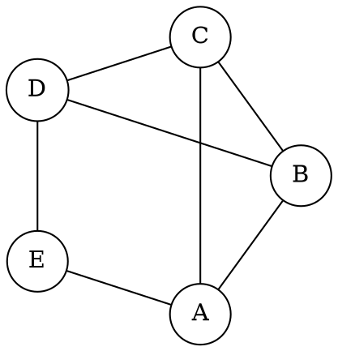

## Add new docs

This site use Docsify to generate the documentation site. It's fairly simple to use:

1. Create a new Markdown file (e.g., `new-page.md`) in `docs` directory

2. Add the new page to the sidebar navigation by editing `_sidebar.md`. It uses markdown list syntax for navigation, like this:

```markdown
- [New Page](new-page.md)
```

## Removing docs

To remove a page from the docs, simply remove it from the `_sidebar.md` file.

## Insert graphviz dot files

I've written a [plugin](https://github.com/hrz6976/docsify-viz) to render graphviz dot files.

You can wrap your graphviz code in a code block:

````markdown

````

Or add an .dot image:

```markdown

```
